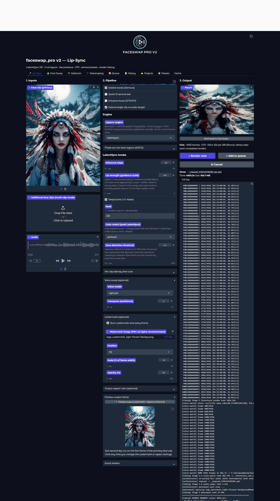
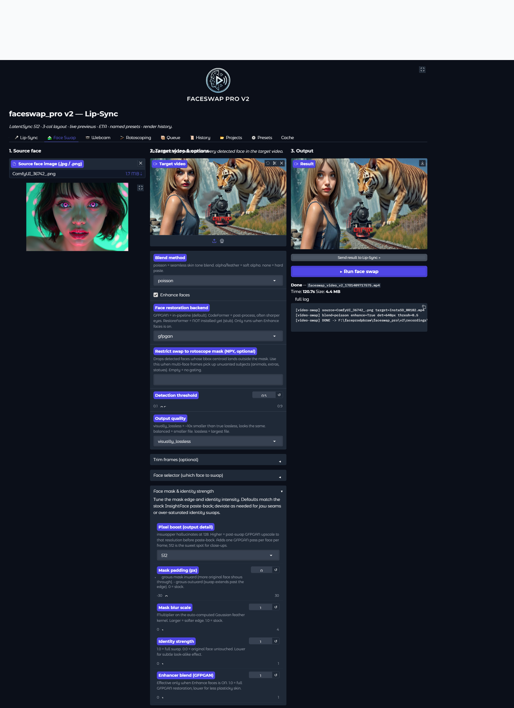
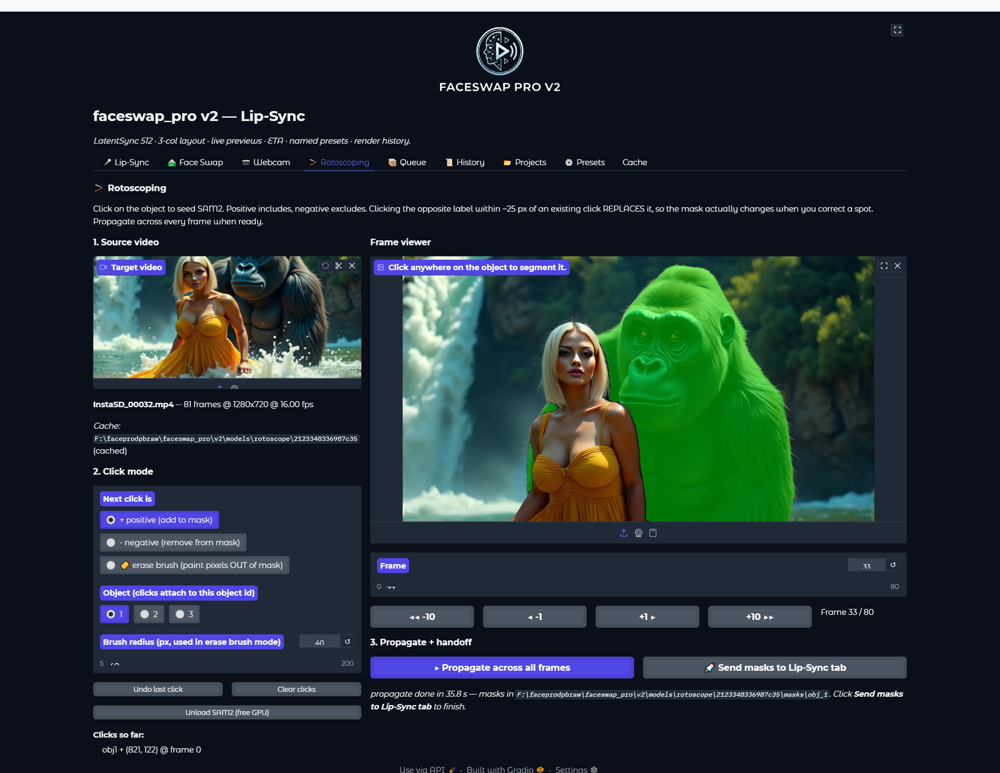
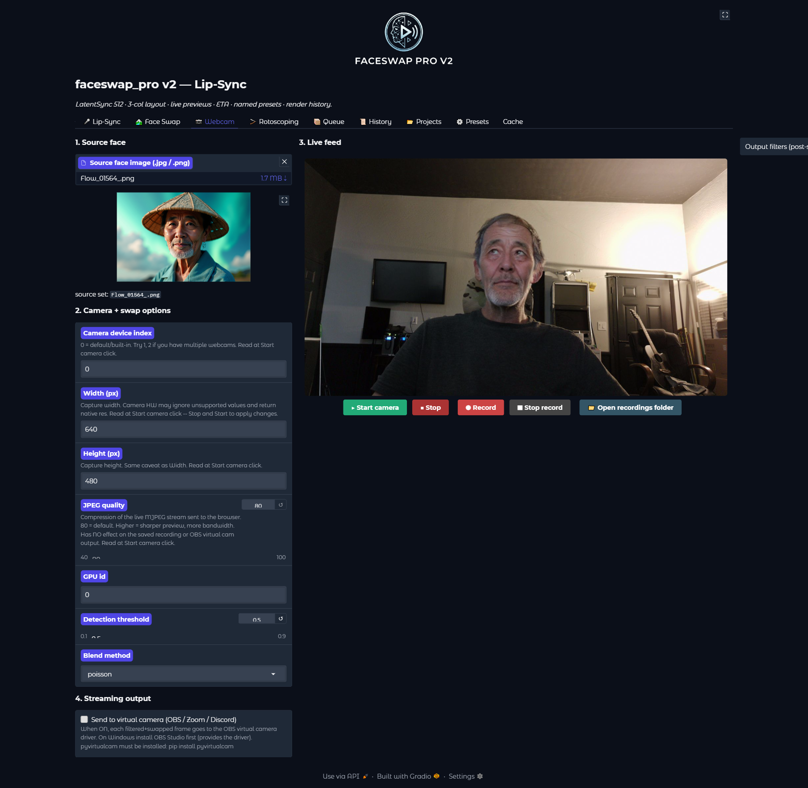

# faceswap_pro v2

A desktop Gradio app for AI face-swap, lip-sync, voice clone, and
rotoscoping on video. Built on LatentSync 1.6 (lip-sync),
InsightFace inswapper_128 (face-swap), GFPGAN / CodeFormer /
RestoreFormer++ (face restoration), Demucs (vocal isolation),
SAM 2 (multi-object segmentation + mask propagation), and RVC
(voice cloning).



> **Synthetic media notice.** This software produces realistic
> face-swapped and lip-synced video. Before you use it, read
> [USAGE_POLICY.md](USAGE_POLICY.md). Non-consensual sexual imagery,
> CSAM, fraudulent impersonation, and political disinformation
> are prohibited.

---

## What it does

Five tabs, one window, one GPU:

- **Lip-Sync tab** — drive a face video with new audio (LatentSync
  1.6). Per-clip identity fine-tune, SAM 2 mask-out for non-face
  objects in frame, Demucs vocal isolation, voice swap (RVC),
  selectable face restorer (GFPGAN / CodeFormer / RestoreFormer++),
  watermark, aspect reshape, and post-render Reinhard color match
  to fix LatentSync's VAE color drift on stylized sources.
- **Face-Swap tab** — paste a source identity onto every face in a
  target video (inswapper_128). Identity blend / embedding journey,
  reference-face selector, mask padding/blur, identity strength,
  enhancer blend, pixel boost (256/384/512/768 upscale on the swap
  crop), temporal smoothing, Reinhard / shadow-correction lighting
  transfer, and a Rotoscope-mask gate so face swap only fires
  inside a region you authored.
- **Rotoscope tab** — Photoshop / RotoBrush-style mask authoring
  on a video. Click any subject to segment, propagate the mask
  across the timeline (SAM 2 with per-object incremental updates),
  add multiple subjects, refine with positive/negative clicks, paint
  with a manual brush-erase layer. Save as `.npy` and *Send to
  Lip-Sync* or *Send to Face-Swap* — the receiving tab gates the
  render on that mask.
- **Webcam tab** — real-time face-swap on a webcam feed with
  optional Windows virtual camera output (pyvirtualcam / OBS).
- **History tab** — every render writes a JSON sidecar next to the
  MP4 with the full knob payload + timing. Click **Restore
  settings** on any past render to repopulate the originating tab
  exactly. Pair this with **Projects** (save/load named knob bundles
  spanning both render tabs at once) for full session
  reproducibility.

### Workflow plumbing across all tabs

- **Send to ->** buttons hand outputs between tabs without
  re-uploading: Rotoscope mask -> Lip-Sync / Face-Swap; Lip-Sync
  output -> Face-Swap source video; Face-Swap output -> Lip-Sync
  source video.
- **Projects** — save the entire Lip-Sync + Face-Swap knob state to
  a named project file, reload at any time, share `.fpproj` files
  with collaborators.
- **JSON sidecars** — every render automatically writes
  `<output>.job.json` with all model versions, knob values, file
  paths, frame counts, elapsed time, and effective s/frame. Audit
  trails come free.
- **Launch-time integrity prechecks** — `launch.py` runs
  `tools/check_tail_integrity.py` (null-byte + AST parse sweep) and
  `tools/check_public_symbols.py` (regression check vs a captured
  baseline) over every source file before starting the server.
  Refuses to boot on regression; set `FACESWAP_SKIP_PRECHECK=1` to
  bypass.
- **Single-GPU render lock** — foreground "Run" and background queue
  share one render lock so two renders never share the GPU.

---

## Quick start

### 1. Prerequisites

- **Windows 10/11** (Linux/macOS untested but plausibly works)
- **NVIDIA GPU** with 16 GB+ VRAM (24 GB recommended for fine-tune)
- **Python 3.10** in a venv (LatentSync 1.6 + diffusers 0.32.x +
  PyTorch 2.4 cu121 is the validated combo)
- **Git** and **ffmpeg** on PATH (optional — bundled fallback via
  `imageio-ffmpeg`)

### 2. Clone + install

```bash
git clone https://github.com/seedhunterai/faceswap_pro_v2.git
cd faceswap_pro_v2

python -m venv venv_new
venv_new\Scripts\activate     # Windows
# source venv_new/bin/activate # Linux/macOS

pip install -r requirements.txt
```

### 3. Acquire the inswapper_128 model

This file is **not bundled** for licensing reasons. See
[INSTALL.md § inswapper_128](INSTALL.md#inswapper_128) for sourcing.
Place it at:

```
checkpoints/inswapper_128.onnx
```

### 4. Launch

```bash
python launch.py
# or on Windows:
launch.bat
```

First-run downloads (cached after first launch):
- LatentSync 1.6 UNet (~5 GB, from HuggingFace `ByteDance/LatentSync-1.6`)
- Whisper tiny (~78 MB)
- GFPGAN v1.4 + facial landmarks (~350 MB)
- CodeFormer (~360 MB, on first selection)
- Demucs htdemucs (~200 MB)
- SAM 2.1 base_plus (~81 MB, on first rotoscope/mask-out use)
- Sub-models for InsightFace buffalo_l (~250 MB)

Plan for ~6 GB of model downloads on first launch.

Browser opens at `http://localhost:7861`.

### 5. (Recommended) Verify your install

```bash
python detect_system.py
```

Audits your GPU, CUDA, every pinned package, and optional weights;
writes `PROJECT_ENV.md` next to itself with a BLOCKER / WARN / PASS
report and a `fix_hint` for anything that needs attention. See
[INSTALL.md § Verify your install](INSTALL.md#verify-your-install-detect_systempy)
for the full description. If you open an issue, attach
`PROJECT_ENV.md` and you'll skip 80% of the back-and-forth.

---

## Features

### Lip-Sync (LatentSync 1.6)

- 512x512 native resolution (1.6 retrained at 512 to fix the blurry
  teeth/lips problem of 1.5).
- DeepCache 2x speedup, deterministic seeds for reproducibility.
- 20-step DDIM default; tunable.
- **Vocal isolation (Demucs)** so the model conditions on clean
  vocals even when the input track is a song with instruments.
- **Per-clip identity fine-tune** (~10-30 min on a 4090) overfits
  motion and attention layers to one source video for much better
  likeness retention.
- **SAM 2 mask-out** — click a non-face object (cat, animal, prop,
  statue) that LatentSync would wrongly latch onto; the region is
  inpainted before lip-sync and composited back after.
- **Per-clip extension** — loop-pad short clips to audio length.
- **Selectable face restorer** — GFPGAN (default), CodeFormer
  (better identity preservation at high enhancement), or
  RestoreFormer++ (sharper detail on close-ups). Pluggable
  backend registry in `core/face_restoration/`.
- **Reinhard color match (Stage 2.4)** — Haar-cascade face crop +
  Reinhard LAB transfer from source to lipsync output, fixing the
  warm-cheek / cyan-skin drift that LatentSync's VAE introduces on
  stylized or non-photoreal sources. Toggleable: `off`, `reinhard`
  (default), `face-only` (mask-restricted).

### Face-Swap (inswapper_128)



- 128-native inswapper with stable face alignment.
- **Pixel boost** (256/384/512/768) — post-swap upscale on the
  aligned face crop with scaled warp matrix; cleans up close-ups.
- **Face mask padding + blur** — fix jaw-line seams without
  touching the model.
- **Identity strength** — LERP between full swap (1.0) and
  original face (0.0).
- **Enhancer blend** — control restoration intensity
  (anti-plasticky-skin slider).
- **Selectable face restorer** — same GFPGAN / CodeFormer /
  RestoreFormer++ choice as Lip-Sync.
- **Face selector mode** — `largest` (default) or `reference`:
  upload a reference image to swap only the matching face in
  multi-person videos.
- **Identity blend** — two source images, alpha slider, hybrid
  identity in ArcFace space.
- **Embedding journey** — alpha ramps A->B across the timeline for
  a continuous identity morph (linear or smoothstep curve).
- **Temporal smoothing** — EMA on detected face boxes across frames
  reduces jitter on shaky sources.
- **Reinhard / shadow-correction lighting transfer** — match swap
  to target frame's color and shadow stats so the paste-back
  doesn't read as "stickered on."
- **Rotoscope-mask gate** — point at a `.npy` mask stack from the
  Rotoscope tab; face swap only fires inside the masked region per
  frame. Solves the "wrong face got swapped" problem in crowds and
  the "gorilla received the girl's identity" problem in
  human+creature scenes.
- Trim by frame, output quality
  (`visually_lossless` / `balanced` / `lossless`).

### Rotoscope



- **SAM 2 backend** running as a long-lived daemon (loaded once,
  many clicks).
- **Multi-object** — click subject 1, paint clicks. Click subject 2,
  paint different clicks. Each object gets its own propagated
  mask track.
- **Per-object positive / negative click refinement** —
  add-to-this-thing vs not-this-thing, cumulative.
- **Mask propagation** — once any frame is clicked, SAM 2
  propagates the mask through every frame in both directions.
- **Manual brush-erase layer** — Photoshop-style pixel erase on
  top of the SAM 2 mask for the corners SAM gets wrong.
- **Send to Lip-Sync** / **Send to Face-Swap** — writes the
  per-frame mask stack as a `.npy` and wires it into the
  receiving tab's mask field.
- **Browser-safe source video** — source MP4 is transcoded
  to H.264 / AAC / faststart on load so Gradio's `<video>` tag
  never throws "Video not supported" on weird codecs.

### Webcam



- Real-time face-swap on webcam input.
- Optional Windows virtual camera output (OBS / pyvirtualcam).
- Brightness / contrast / saturation filters (collapsible).
- Recording to MP4 + "Open recordings folder" shortcut.
- Platform-aware camera backend selection (CAP_DSHOW on Windows).

### Job queue & history

- Submit lip-sync jobs from the Lip-Sync tab's "Queue" button.
- Queue worker drains them serially; foreground "Run" button and
  queue worker share a single render lock so two renders never
  share one GPU.
- Cancel honored both during and before render (wakes a queued
  job to abort before model loads).
- **Restore settings** — any past render can re-populate the
  originating tab from its sidecar with one click.
- **Projects** — save/load entire session knob state across
  Lip-Sync + Face-Swap tabs as a named `.fpproj` file.

---

## Documentation

- **[INSTALL.md](INSTALL.md)** — detailed install + model download
  + Windows quirks
- **[USAGE.md](USAGE.md)** — per-tab user manual with screenshots
- **[USAGE_POLICY.md](USAGE_POLICY.md)** — what you may and may not
  use this software for
- **[CONTRIBUTING.md](CONTRIBUTING.md)** — contributor workflow,
  code style, testing
- **[CHANGELOG.md](CHANGELOG.md)** — release notes
- **[THIRD_PARTY_NOTICES.md](THIRD_PARTY_NOTICES.md)** — upstream
  licenses and citations
- **[CITATION.cff](CITATION.cff)** — cite this project in academic
  work

---

## Architecture overview

Key modules:

- `faceswap/orchestrator.py` — stages a render through voice swap ->
  vocal isolation -> optional mask-out -> lip-sync -> optional
  composite-back -> Reinhard color match -> optional restoration ->
  aspect -> watermark -> mux. Single global render lock.
- `core/pipeline.py` — face-swap pipeline (detect, identity, swap,
  audio-sync, lighting, blend, temporal, enhance per frame). Per-
  frame rotoscope-mask filter `_filter_faces_by_mask` drops
  detected faces outside the masked region.
- `core/swap_backends/` — pluggable swap backend registry. `base.py`
  abstract; `inswapper.py` is the shipped engine.
- `core/lipsync.py` — LatentSync subprocess invocation, dep probe,
  HuggingFace download, checkpoint resolution.
- `core/lipsync_color_match.py` — Stage 2.4 Reinhard LAB transfer
  with Haar-cascade face crop and feathered mask blending.
- `core/face_restoration/` — pluggable face-restorer backends
  (GFPGAN / CodeFormer / RestoreFormer++) with auto-download.
- `core/maskout_pipeline.py` — SAM 2 multi-click -> TELEA inpaint ->
  void source -> caller runs lip-sync -> composite-back.
- `core/sam2_daemon.py` — long-lived SAM 2 process for the
  Rotoscope tab; warmup on `load_video`, incremental
  `add_new_points_or_box` calls per click.
- `core/rotoscope_cache.py` — per-source frame extraction cache and
  `.npy` mask stack writer.
- `core/browser_safe_preview.py` — ffprobe-gated H.264/AAC/faststart
  transcode for rotoscope source preview.
- `core/lipsync_finetune.py` — per-clip identity fine-tune via
  `LatentSync/scripts/train_oneshot.py` subprocess.
- `faceswap/projects.py` — `.fpproj` save/load for session bundles.
- `faceswap/previews.py` — sidecar writers
  (`write_sidecar` for lipsync, `write_video_swap_sidecar` for face
  swap), thumbnail + waveform extractors.
- `faceswap/rotoscope/ui.py` — Rotoscope tab Gradio surface.
- `tools/check_tail_integrity.py`, `tools/check_public_symbols.py` —
  launch-time integrity prechecks.

---

## Citing this project

If you use faceswap_pro in academic work, please cite the project
metadata in [CITATION.cff](CITATION.cff). If you use any of the
upstream models (LatentSync, inswapper_128, GFPGAN, CodeFormer,
RestoreFormer, SAM 2, Whisper, Demucs, RVC), please cite their
original papers — see [THIRD_PARTY_NOTICES.md](THIRD_PARTY_NOTICES.md).

---

## License

Apache License 2.0 — see [LICENSE](LICENSE).

Additional usage restrictions apply — see
[USAGE_POLICY.md](USAGE_POLICY.md).
